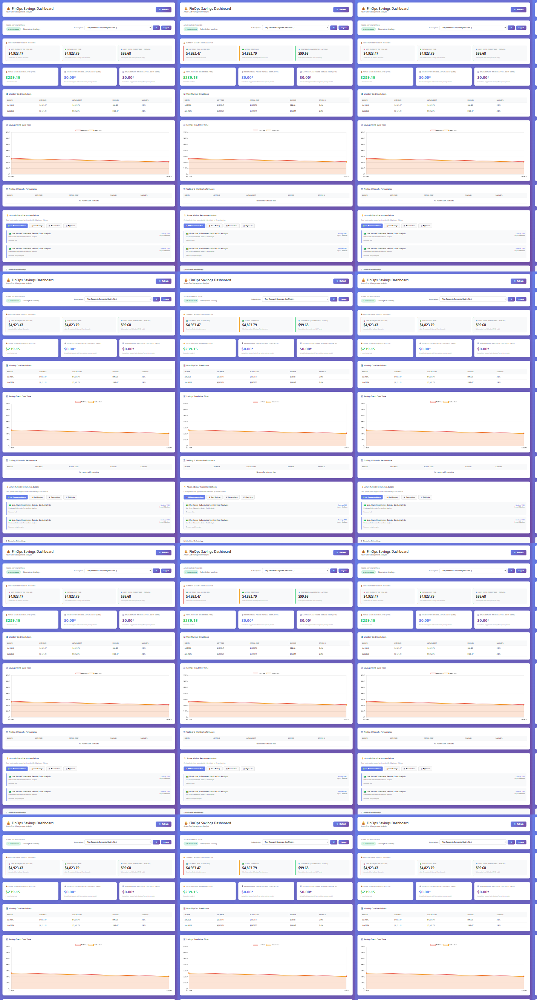
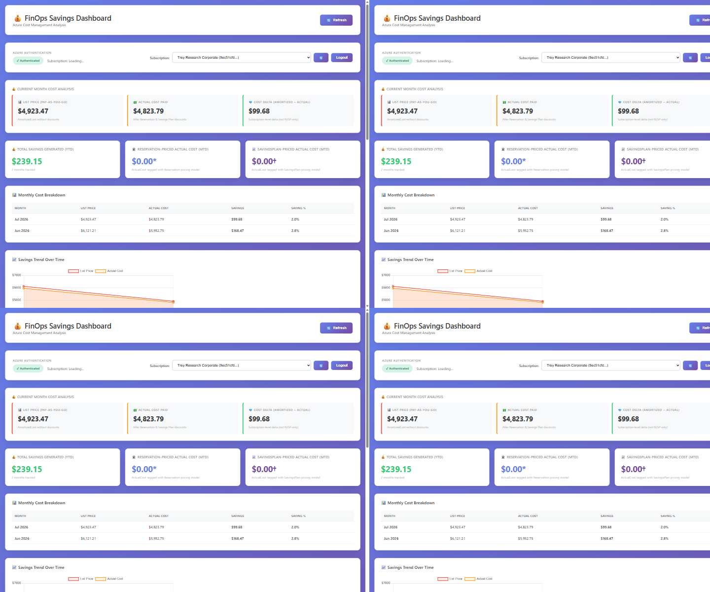
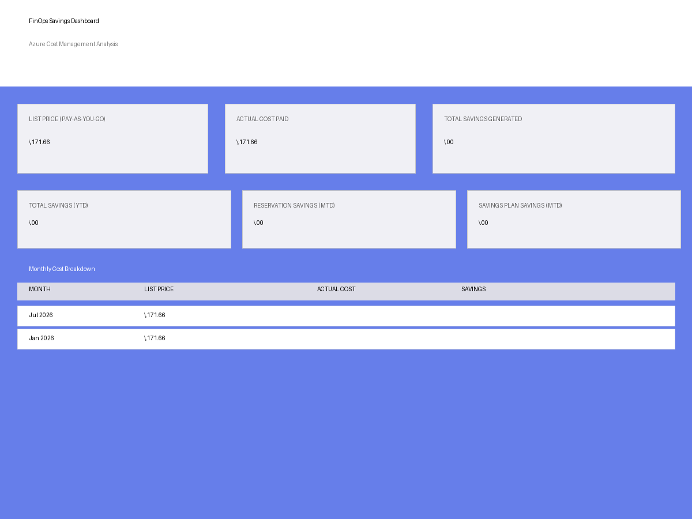

# Azure FinOps Savings Reporting Dashboard

Professional real-time dashboard for Azure Reservation and Savings Plan savings analysis using the Azure Cost Management API, with Azure Advisor recommendations and OAuth2 authentication.

[](#optional-one-click-deploy-to-azure)
[](https://github.com/jerrywolff_microsoft/cost_savings_reporting/actions/workflows/deploy-appservice.yml)

## Local Deployment Quick Start

Run locally in one command (Windows PowerShell):

```powershell
./scripts/deploy_local.ps1
```

Then open:
- http://127.0.0.1:8000

Optional:
- `./scripts/deploy_local.ps1 -Port 8080`
- `./scripts/deploy_local.ps1 -SkipAzureCheck`

## ✨ Features

- **Real-time Dashboard** – Live cost analysis with month-to-date, YTD, and trailing 12-month metrics
- **Azure Advisor Integration** – Automatically fetch and display cost savings recommendations
- **Resource-Level Breakdown** 🆕 – View detailed breakdown of where Reservations and Savings Plans were applied
- **Multi-Subscription Support** – Switch between 90+ subscriptions with one click
- **OAuth2 Authentication** – Secure browser-based login with Azure
- **Cost Breakdown** – List price vs actual cost vs savings with detailed metrics
- **Interactive Charts** – Chart.js visualization of cost trends
- **Rate Limit Handling** – Exponential backoff retry logic (1-60s delays)
- **Auto-Start Server** – VS Code task auto-launches dashboard on workspace open
- **Professional UI** – Responsive grid layout, mobile-friendly design
- **5-Minute Caching** – Configurable dashboard cache with stale-data fallback

## 📸 Screenshots

### Updated Dashboard View (Current UI)


### Updated Cost Metrics View


### Legacy Main Dashboard View


The FinOps dashboard provides a comprehensive real-time view of your Azure cost savings with:
- **Header**: Dashboard title with Refresh button for real-time data updates
- **Authentication Panel**: Current subscription status with multi-subscription selector (90+ subscriptions) and OAuth2 login/logout controls
- **Key Metrics Cards**:
  - 📋 **List Price (Pay-As-You-Go)** - Total cost without discounts (AmortizedCost baseline)
  - 💳 **Actual Cost Paid** - What was actually charged after Reservations & Savings Plans (ActualCost)
  - ✅ **Cost Delta (Amortized - Actual)** - Subscription-level delta between amortized and actual cost
- **Monthly Breakdown Table** - Detailed view of all months with savings metrics
- **Azure Advisor Recommendations** - Cost optimization opportunities with impact levels and estimated savings
- **Interactive Charts** - Chart.js visualizations of cost trends and savings analysis
- **Resource Filtering** - Search and filter by resource name or type with wildcard support
- **CSV Export** - Download detailed resource data for further analysis

### Example Workflow
1. **Login** → OAuth2 browser-based authentication with interactivebrowsercredential
2. **Select Subscription** → Switch between available subscriptions in dropdown
3. **View Metrics** → Dashboard auto-loads current month, YTD, and trailing 12-month data
4. **Drill Down** → Click on resources or use filter to see which got Reservations vs Savings Plans
5. **Export** → Download data to CSV for further analysis or reporting

## Architecture

```
┌─────────────────────────────────────────────────────────────┐
│             Frontend (dashboard.html)                       │
│  - OAuth2 Login Form                                        │
│  - Cost Cards (List Price, Actual Cost, Total Savings)     │
│  - Azure Advisor Recommendations Section                    │
│  - Monthly Breakdown Table                                  │
│  - Chart.js Visualization                                   │
└────────────────────┬────────────────────────────────────────┘
                     │ REST API (CORS-enabled)
                     ▼
┌─────────────────────────────────────────────────────────────┐
│             FastAPI Server (dashboard_api.py)               │
│  Endpoints:                                                 │
│  - POST   /auth/login                                       │
│  - GET    /auth/status                                      │
│  - GET    /auth/subscriptions                               │
│  - POST   /auth/switch-subscription/{id}                    │
│  - GET    /api/dashboard (5-min cache)                      │
│  - GET    /api/advisor-recommendations                      │
└────────────────────┬────────────────────────────────────────┘
                     │ Azure SDK + Cost Management API
                     ├─ InteractiveBrowserCredential (OAuth2)
                     ├─ SubscriptionClient (list subscriptions)
                     ├─ AdvisorManagementClient (recommendations)
                     └─ CostManagementClient (cost queries)
                     ▼
┌─────────────────────────────────────────────────────────────┐
│          Azure Cost Management API                          │
│  - Query ActualCost (no pricing model filter)               │
│  - Query AmortizedCost (list price baseline)                │
│  - Parse costs by pricing model (OnDemand, Reservation...)  │
│  - Rate limiting: 429 with exponential backoff              │
└─────────────────────────────────────────────────────────────┘
```

## Setup

### Prerequisites
- Python 3.11+
- Azure subscription with Cost Management access
- VS Code (for auto-start feature)
- Internet connection for OAuth2 flow

### 1. Clone and install

```bash
cd c:\.git\cost_savings_reporting
python -m venv venv
venv\Scripts\activate  # On Windows

pip install -r requirements.txt
```

### 2. Configure authentication

#### Option A: Managed Identity (Recommended for Azure-hosted)
If running on Azure VM, App Service, or Container Apps:
```bash
# No configuration needed - DefaultAzureCredential will detect Managed Identity
```

#### Option B: Azure CLI (Local development)
```bash
az login
az account set --subscription "your-subscription-id"
```

#### Option C: Service Principal
```bash
# Create service principal
az ad sp create-for-rbac --name FinOpsReportingAgent

# Configure environment
copy .env.example .env

# Edit .env with:
AZURE_CLIENT_ID=your-client-id
AZURE_CLIENT_SECRET=your-client-secret
AZURE_TENANT_ID=your-tenant-id
AZURE_SUBSCRIPTION_ID=your-subscription-id
```

### 3. Set RBAC permissions

Assign **Cost Management Reader** role to your identity:

```bash
az role assignment create \
  --assignee <principal-id> \
  --role "Cost Management Reader" \
  --scope /subscriptions/<subscription-id>
```

### 4. Run the API

```bash
# Production
uvicorn dashboard_api:app --host 0.0.0.0 --port 8000

# Development (with reload)
uvicorn dashboard_api:app --reload
```

API will be available at `http://localhost:8000`

## API Endpoints

### Health Check
```bash
GET /health
```

Response:
```json
{
  "status": "healthy",
  "timestamp": "2026-07-21T15:30:00.000000",
  "client_initialized": true
}
```

### Current Month (MTD)
```bash
GET /api/current-month
```

Response:
```json
{
  "month": "2026-07",
  "reservation_savings": 15450.25,
  "savings_plan_savings": 8200.50,
  "total_savings": 23650.75,
  "reservation_quantity": 1247,
  "savings_plan_quantity": 892,
  "query_timestamp": "2026-07-21T15:30:00.000000"
}
```

### Specific Month
```bash
GET /api/month/2026/06
```

Response: Same structure as current month

### Year-to-Date Summary
```bash
GET /api/ytd
```

Response:
```json
{
  "current_month": { ... },
  "ytd_summary": {
    "total_reservation_savings": 95000.00,
    "total_savings_plan_savings": 52000.00,
    "total_savings": 147000.00,
    "months_tracked": 7
  },
  "monthly_breakdown": {
    "2026-01": { ... },
    "2026-02": { ... },
    ...
  },
  "query_timestamp": "2026-07-21T15:30:00.000000"
}
```

### Trailing 12 Months
```bash
GET /api/trailing-12-months
```

### Full Dashboard
```bash
GET /api/dashboard
```
Comprehensive view with all metrics (current month, YTD, monthly breakdown, trailing 12 months)

## Usage Examples

### Python Client
```python
from cost_api import CostManagementClient, get_savings_summary

client = CostManagementClient("your-subscription-id")

# Current month
current = client.get_current_month_savings()
print(f"Current Savings: ${current.total_savings:,.2f}")

# Full dashboard
summary = get_savings_summary(client)
print(summary)
```

### cURL
```bash
# Get dashboard data
curl http://localhost:8000/api/dashboard

# Get current month
curl http://localhost:8000/api/current-month

# Get specific month
curl http://localhost:8000/api/month/2026/06

# Get YTD
curl http://localhost:8000/api/ytd
```

### JavaScript/Frontend
```javascript
// Fetch dashboard data
const response = await fetch('http://localhost:8000/api/dashboard');
const data = await response.json();

console.log('Current Month Savings:', data.current_month.total_savings);
console.log('YTD Total:', data.ytd.total_savings);
```

## Calculation Methodology

### Cost Delta
```
Cost Delta = AmortizedCost - ActualCost
```

### Reservation-Priced Actual Cost
```
Reservation-Priced Actual Cost = Sum(ActualCost where PricingModel = "Reservation")
```

### SavingsPlan-Priced Actual Cost
```
SavingsPlan-Priced Actual Cost = Sum(ActualCost where PricingModel = "SavingsPlan")
```

### Notes
- Cost Delta is a subscription-level billing delta and is not always equivalent to confirmed RI/SP savings.
- The UI now explicitly flags when cost delta exists without active Reservation/SavingsPlan-priced cost activity.

## Performance Notes

- **Real-time**: API calls fetch live Cost Management data (no caching on first load)
- **Latency**: ~2-5 seconds per query depending on data volume
- **Caching strategy** (optional):
  - Cache current month for 1 hour
  - Cache historical months indefinitely
  - Cache YTD/trailing-12 for 4 hours

- **Rate limits**: Cost Management API allows ~100 requests/minute per subscription

## Deployment Options

### Option 1: Local Computer (No Azure Hosting Required)

Use the included local deployment script:

```powershell
./scripts/deploy_local.ps1
```

Optional flags:

```powershell
# Use a different local port
./scripts/deploy_local.ps1 -Port 8080

# Skip Azure CLI login check
./scripts/deploy_local.ps1 -SkipAzureCheck
```

This script will:
- Create a virtual environment if missing
- Install/update dependencies
- Create `.env` from `.env.example` if needed
- Check Azure CLI login status (optional)
- Launch Uvicorn locally

### Option 2: Azure App Service (Recommended for Cloud)

Use the included deployment script:

```powershell
./scripts/deploy_appservice.ps1 -ResourceGroup rg-finops-dashboard -AppName finops-savings-dashboard
```

This script will:
- Create/update the Resource Group
- Provision App Service resources
- Deploy this repository to Web App
- Configure FastAPI startup command for Uvicorn

### Optional One-Click Deploy to Azure

Use this button to create the App Service infrastructure from the included ARM template:

[](https://portal.azure.com/#create/Microsoft.Template/uri/https%3A%2F%2Fraw.githubusercontent.com%2Fjerrywolff_microsoft%2Fcost_savings_reporting%2Fmain%2Finfra%2Fazuredeploy.json)

Template files included:
- `infra/azuredeploy.json`
- `infra/azuredeploy.parameters.json`

### Option 3: GitHub Actions to App Service (Manual Trigger)

Workflow included:
- `.github/workflows/deploy-appservice.yml`

Required repository secrets:
- `AZURE_WEBAPP_NAME`
- `AZURE_WEBAPP_PUBLISH_PROFILE`

Then run the workflow from GitHub Actions (supports optional test run before deploy).

### Option 4: Azure Container Apps
```bash
az containerapp up --name finops-api --source .
```

### Option 5: Kubernetes
```bash
kubectl apply -f k8s-deployment.yaml
```

### Option 6: Docker
```bash
docker build -t finops-api .
docker run -p 8000:8000 -e AZURE_SUBSCRIPTION_ID=<id> finops-api
```

## Testing

```bash
# Run unit tests
pytest tests/

# Test endpoints locally
python -m pytest tests/test_api.py -v
```

## Troubleshooting

### "Cost Management client not initialized"
- Verify `AZURE_SUBSCRIPTION_ID` environment variable is set
- Check Azure authentication (run `az login` or verify service principal)

### "Unauthorized" (401)
- Verify identity has **Cost Management Reader** role
- Check token expiration

### "No data returned"
- Verify the subscription has Reservations or Savings Plans
- Check date range (API returns empty if no matching usage)

## Recreate This Project

To rebuild this entire FinOps dashboard from scratch using Copilot or an AI assistant, use this comprehensive prompt:

### Full Recreate Prompt

```
Create a professional Azure FinOps Savings Dashboard with the following specification:

## PROJECT OVERVIEW
Build a real-time dashboard API that displays Azure Reservation and Savings Plan savings, with OAuth2 authentication, Azure Advisor integration, and multi-subscription support.

## ARCHITECTURE REQUIREMENTS
- Frontend: Single HTML5 file with vanilla JavaScript (no frameworks)
- Backend: FastAPI (Python 3.11+) with Uvicorn ASGI server
- Authentication: OAuth2 browser-based flow with InteractiveBrowserCredential
- APIs: REST endpoints with CORS enabled for localhost:8000
- Caching: 5-minute dashboard cache with stale-data fallback
- Database: None (real-time API queries only)

## BACKEND REQUIREMENTS (dashboard_api.py - FastAPI Server)

### Global State
- cost_client: CostManagementClient (reinitialized on subscription switch)
- current_subscription: str (persists across requests, default: first available)
- cached_credential: InteractiveBrowserCredential (cached post-login)
- dashboard_cache: Dict with 300s TTL

### Authentication Endpoints
- POST /auth/login: OAuth2 browser flow (redirects to login.microsoftonline.com)
- GET /auth/status: Return auth state and current subscription
- GET /auth/subscriptions: List all available subscriptions (parse from SubscriptionClient)
- POST /auth/switch-subscription/{id}: Switch active subscription, clear cache, reinitialize cost client

### Data Endpoints
- GET /api/dashboard: Main endpoint with 5-minute cache
  Returns: { current_month, ytd, monthly_breakdown, trailing_12_months }
- GET /api/advisor-recommendations: Fetch cost optimization recommendations
  Filters: Cost, HighAvailability, HighReliability categories
  Response: [{ estimated_savings, affected_resource, problem, solution, impact_level }]

### Azure SDKs Required
- azure-identity 1.15.0: InteractiveBrowserCredential
- azure-mgmt-subscription 3.1.1: List subscriptions
- azure-mgmt-advisor 9.0.1: Fetch recommendations
- requests library for Cost Management API calls

### Cost Management API Integration
- Query ActualCost (no pricing model filter) to get real spending
- Query AmortizedCost (also no filter) to get list price baseline
- Rate limiting: Implement exponential backoff (5 retries, 1-60s delays)
- 2-second inter-query delay to avoid 429 errors
- Query scope: Current month + January + March (3 months to avoid rate limiting)
- Parsing: Extract CostUSD from rows, group by PricingModel (OnDemand, Reservation, SavingsPlan)

### Cost Calculation Logic
- List Price: Sum of all AmortizedCost (what you'd pay at full on-demand rates)
- Actual Cost: Sum of all ActualCost (what was actually charged after discounts)
- Total Savings: List Price - Actual Cost (capped to max 99.9%)
- Break down by pricing model: Reservation cost, SavingsPlan cost separately

### Advisor Integration
- Fetch recommendations using REST API (not SDK)
- Filter by category: "Cost" or "HighAvailability"
- Extract: estimated_savings, affected_resource, problem, solution
- Cache for 5 minutes per subscription
- Support multiple subscriptions

## FRONTEND REQUIREMENTS (dashboard.html - Responsive UI)

### HTML Structure
- Header: Title "💰 FinOps Savings Dashboard", Refresh button
- Auth Panel: Status badge, subscription dropdown (93+ options), Login/Logout buttons
- Cost Cards: 
  - 📊 List Price (Pay-As-You-Go)
  - 💰 Actual Cost Paid (with real data, not $0.00)
  - 💸 Total Savings Generated
- Advisor Section: Filter buttons (All, Cost Savings, Reservations, Right-size)
- Recommendation Cards: Estimated savings, impact level, emoji icons
- Monthly Table: Month, List Price, Actual Cost, Savings (filter empty rows)
- Trailing 12-Month Table: Month-by-month trend data
- Chart.js Line Chart: Multiple datasets (monthly vs trailing)
- Methodology Section: Explain calculation approach
- Timestamp: "Last updated: [time]"

### CSS Styling
- Responsive CSS Grid with mobile breakpoint (768px)
- Professional color scheme: Dark backgrounds, light text, blue accents
- Cost cards with $-formatted values
- Advisor cards with emoji icons based on recommendation type
- Loading spinner (CSS animation) during API calls
- Status badges: Green (✓ Authenticated), Red (✗ Not Authenticated)

### JavaScript Functions Required
- azureLogin(): Trigger OAuth2 browser flow
- loadSubscriptions(): Fetch and populate subscription dropdown
- switchSubscription(): POST to /auth/switch-subscription/{id}
- azureLogout(): Clear session, reset UI
- updateAuthUI(): Show/hide buttons based on auth state
- fetchDashboardData(): GET /api/dashboard with error handling
- renderDashboard(data): Display all cost metrics and tables
- fetchAdvisorRecommendations(): GET /api/advisor-recommendations
- renderAdvisorRecommendations(data): Display advisor section
- displayFilteredRecommendations(recommendations): Filter by category
- filterAdvisorRecommendations(filter): Set active filter
- getRecommendationIcon(category, problem): Smart emoji selection
- checkAuthStatus(): Initial auth check on page load
- updateTimestamp(): Show last updated time
- showLoading(): Display spinner
- showError(message): Display error message
- refreshDashboard(): Force refetch data

### Data Validation
- Savings capped to list price (can't exceed it)
- Savings percentage capped at 99.9% max
- Filter monthly/trailing tables to show only months with costs > 0
- Handle empty data gracefully (show "No data" message)

## ADDITIONAL CONFIGURATION (cost_api.py - Cost Management Client)

### CostManagementClient Class
- __init__(subscription_id): Initialize with subscription
- query_costs(start_date, end_date, cost_type, pricing_models): Main query method
  - cost_type: "ActualCost" or "AmortizedCost"
  - pricing_models: None (get ALL), or ["Reservation", "SavingsPlan"]
  - Implement 429 retry logic with exponential backoff
- _parse_savings_response(response, start_date, end_date): Extract costs
  - Parse rows from response["properties"]["rows"]
  - Extract CostUSD and PricingModel columns
  - Aggregate costs by pricing model
  - Return MonthlySavings dataclass
- get_current_month_savings(): Query current month MTD
- get_month_savings(year, month): Query specific month
- get_savings_summary(client): Query current + Jan + Mar (3 months)

### MonthlySavings Dataclass
Fields: month, on_demand_list_price, on_demand_actual_cost, reservation_actual_cost, savings_plan_actual_cost, total_actual_cost, reservation_savings, savings_plan_savings, total_savings, reservation_quantity, savings_plan_quantity, reservation_effective_price, savings_plan_effective_price

## VS CODE INTEGRATION

### .vscode/tasks.json
- Task: "Start FinOps Dashboard Server"
  - Runs on folder open (runOn: "folderOpen")
  - Command: python -c "import sys; sys.path.insert(0, '.\\venv\\Lib\\site-packages'); import uvicorn; uvicorn.run('dashboard_api:app', host='127.0.0.1', port=8000, log_level='info')"
  - Background: true (doesn't block VS Code)
  - Pattern matcher: Waits for "Application startup complete"

### .vscode/launch.json
- Python debug configuration with Uvicorn support
- Module: uvicorn with args for dashboard_api:app

### .vscode/settings.json
- Python interpreter: .venv/Scripts/python.exe
- Format on save: true
- Black formatter enabled
- Pylint enabled

### .vscode/extensions.json
- Recommended: ms-python.python, Pylance, Black Formatter, Ruff

## KEY BUG FIXES IMPLEMENTED

### Bug 1: ActualCost $0.00 (CRITICAL - FIXED)
- Problem: Dashboard showed "$0.00" Actual Cost despite "$403.41" List Price
- Root Cause: Queries were filtering with pricing_models=["Reservation", "SavingsPlan"], excluding OnDemand costs
- Solution: Query with pricing_models=None to get ALL pricing models including OnDemand
- Result: OnDemand actual costs now show real values

### Bug 2: 100% Savings Percentage (FIXED)
- Solution: Cap total_savings to max(0, min(savings, listPrice))
- Frontend: Cap percentage display to 99.9% max

### Bug 3: Azure Module Import Failures (FIXED)
- Problem: ModuleNotFoundError for azure packages despite installation
- Root Cause: Missing __init__.py files in venv azure directories
- Solution: 
  - Add sys.path.insert(0, dirname) to dashboard_api.py
  - Create __init__.py files in venv/Lib/site-packages/azure/ and /azure/mgmt/

## REQUIREMENTS.TXT
```
azure-identity==1.15.0
azure-mgmt-subscription==3.1.1
azure-mgmt-advisor==9.0.1
requests==2.31.0
fastapi==0.104.1
uvicorn==0.24.0
pydantic==2.5.0
python-multipart==0.0.6
python-dotenv==1.0.0
```

## DEPLOYMENT CHECKLIST
- [ ] Implement FastAPI server with 6 endpoints
- [ ] Implement cost_api.py with CostManagementClient class
- [ ] Create dashboard.html with Chart.js visualization
- [ ] Add OAuth2 authentication flow
- [ ] Integrate Advisor recommendations API
- [ ] Add 5-minute caching with TTL
- [ ] Implement rate limiting retry logic
- [ ] Create .vscode tasks.json for auto-start
- [ ] Test with real Azure subscription
- [ ] Verify ActualCost shows real costs (not $0.00)
- [ ] Test subscription switching
- [ ] Verify Advisor recommendations load
- [ ] Test mobile responsive design
- [ ] Add error handling for 401/429/400 responses
```

## References

- [Azure Cost Management API](https://learn.microsoft.com/en-us/rest/api/cost-management/)
- [Reservation Savings Calculations](https://learn.microsoft.com/en-us/azure/cost-management-billing/reservations/calculate-ea-reservations-savings)
- [Savings Plan Reporting](https://learn.microsoft.com/en-us/azure/cost-management-billing/savings-plan/utilization-cost-reports)

## License

MIT
