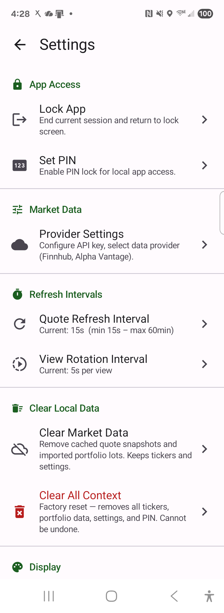
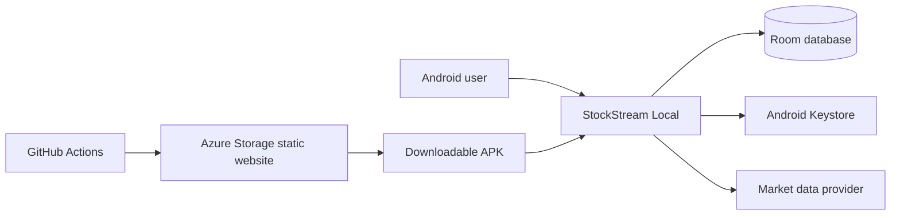

# StockStream Local

[](https://portal.azure.com/#create/Microsoft.Template/uri/https%3A%2F%2Fraw.githubusercontent.com%2Fjerrywolff_microsoft%2Ftokenpulse%2Fmain%2Fdevicehoste_stock_streamer%2Finfra%2Fazuredeploy.json)

StockStream Local is a private, device-first Android portfolio and quote tracker. It calls the selected market-data provider directly, stores portfolio data locally, and labels every displayed value as live, delayed, stale, imported, calculated, unavailable, or not provided.



## Features

- Jetpack Compose and Material 3 interface for Android 8.0 and newer.
- Finnhub streaming and Alpha Vantage polling providers.
- Watchlists, holdings, cost basis, gain/loss, sortable quote columns, and rotating views.
- Fidelity CSV import with validation before persistence.
- Local PIN and biometric unlock with Android Keystore-backed encrypted preferences.
- Room and DataStore persistence with cloud backup disabled.
- Red negative-change and LIVE badges for immediately visible price direction.
- Local Windows deployment and optional Azure-hosted APK distribution.

## Architecture

The Android application has no required backend. Provider credentials and financial data remain on the device. Azure deployment provisions only an HTTPS download site for the APK; it does not receive portfolio data or proxy market-data requests.



## Requirements

- Windows 10 or 11
- JDK 17
- Android SDK 35 and Platform-Tools
- Android 8.0+ device or emulator with USB debugging enabled
- A Finnhub or Alpha Vantage API key for live market data

The Gradle wrapper downloads Gradle 8.11.1 automatically.

## Configure

Create or update the ignored `local.properties` file:

```properties
sdk.dir=C\:\\Users\\YOUR_NAME\\AppData\\Local\\Android\\Sdk
provider.apiKey=YOUR_LOCAL_DEBUG_PROVIDER_KEY
```

The debug build may use `provider.apiKey` as a local default. A key entered in Provider Settings is encrypted and takes precedence. Release and GitHub-built APKs never embed this local key.

## Build and test

```powershell
.\gradlew.bat :app:assembleDebug
.\gradlew.bat :app:testDebugUnitTest
```

The debug APK is written to `app/build/outputs/apk/debug/app-debug.apk`.

## Deploy locally

“Local” deployment means installing the native app on an Android emulator or a USB-connected device from this Windows computer:

```powershell
.\scripts\deploy-local.ps1
```

For multiple devices or a nonstandard Platform-Tools location:

```powershell
.\scripts\deploy-local.ps1 -DeviceId SERIAL -AdbPath C:\path\to\adb.exe
```

The script validates ADB authorization, builds and installs the debug variant, and launches the main activity.

## Deploy to Azure

The button at the top provisions an HTTPS-only Azure Storage account. After provisioning, configure GitHub OIDC by following [.azure/pipeline-setup.md](.azure/pipeline-setup.md), then run **Build and deploy StockStream Local** in GitHub Actions. The workflow builds the APK, deploys [infra/main.bicep](infra/main.bicep), enables static website hosting through the Azure data-plane API, resolves the generated website endpoint, and publishes the download page without storage keys.

The one-click button provisions infrastructure only. Publishing the APK requires the workflow because ARM deployments cannot upload repository build artifacts.

## Security

- Do not commit `local.properties`, `keystore.properties`, API keys, or keystores.
- Mobile API keys can be extracted from a sufficiently compromised device; use a restricted, read-only provider key.
- The Azure distribution build contains no provider key.
- Azure CI uses OIDC and RBAC rather than long-lived client secrets or storage account keys.
- Review provider terms before making direct client-side API calls.

## Regenerate this project with GitHub Copilot

Paste the prompt below into GitHub Copilot Agent mode in an empty workspace. It is intentionally explicit enough to recreate the complete project rather than only a sample screen.

```text
Create a complete, production-quality native Android project named StockStreamLocal. Use Kotlin 2.0.20, Gradle 8.11.1, Android Gradle Plugin 8.5.2, Java 17, compile/target SDK 35, minimum SDK 26, package namespace com.wolffentp.stockstreamlocal, and application ID com.wolffentp.android_stock_tracker. Use Gradle Kotlin DSL and a version catalog. The project must build on Windows with gradlew.bat.

Build the UI entirely with Jetpack Compose using the Compose 2024.08.00 BOM and Material 3. Use Hilt 2.51.1 with KSP for dependency injection, Room 2.6.1 for relational device storage, DataStore Preferences for settings, coroutines and StateFlow for asynchronous state, WorkManager where background scheduling is appropriate, OkHttp 4.12.0 for HTTP and WebSocket transport, and kotlinx.serialization for JSON. Use AndroidX Biometric and Security Crypto for local authentication and encrypted preferences.

Implement a local-only stock and portfolio tracker with no required backend, telemetry, cloud backup, or developer-controlled data collection. Add INTERNET, ACCESS_NETWORK_STATE, USE_BIOMETRIC, and USE_FINGERPRINT permissions. Disable Android backup and data extraction. All tickers, portfolio lots, quote snapshots, settings, layouts, rotating views, and authentication metadata must remain on the device.

Create a clean package structure for auth, columns, csv, data/local, data/model, data/repository, di, market/provider, security, ui/components, ui/navigation, ui/screens, ui/theme, ui/viewmodel, and util. Add a Hilt application class and a single Compose activity.

Implement provider abstractions and concrete Finnhub and Alpha Vantage providers. Finnhub should support WebSocket live updates and REST quote/profile access; Alpha Vantage should support polling and its published free-tier limits. Add connectivity state, refresh state, retry/backoff, rate-limit handling, and provider settings. Never log API keys. Store user-entered keys in Android Keystore-backed EncryptedSharedPreferences. For local debug builds only, read provider.apiKey from ignored local.properties into a BuildConfig DEFAULT_PROVIDER_API_KEY; an encrypted user value takes precedence. Release builds must use an empty default key.

Model quote values with explicit source/quality labels: LIVE, DELAYED, STALE, IMPORTED, CALCULATED, NOT PROVIDED, and UNAVAILABLE. Do not invent missing market values. Render compact badges beside values. When price change is negative, render both the CHG badge and the Symbol column's LIVE badge with the error/red badge color.

Implement screens for local PIN creation/unlock, optional biometric unlock, Home, Watchlist, Add Ticker, Ticker Detail, Fidelity CSV Import, Import Validation, Settings, Provider Settings, Refresh Settings, Column Layout Editor, Rotating Views Editor, Data Quality Legend, and About. Home must include refresh, full-screen, and settings actions; bottom navigation for Home, Watchlist, Import, and Legend; sortable visible columns; holdings editing; online/refresh status; and next/previous rotating-view controls. Create stable, responsive layouts for phones and folding devices.

Implement PBKDF2-SHA256 PIN hashing with a random salt and 200,000 iterations. Store only the derived verifier and metadata in encrypted preferences. Integrate biometric authentication without transmitting biometric state. Disable cloud backup.

Create Room entities, DAOs, repositories, and migrations for tickers, portfolio lots, quote snapshots, column layouts, rotating views, and app settings. Implement computed holdings values such as market value, cost basis, gain/loss, and percentage gain. Keep calculations deterministic and tested.

Implement Fidelity CSV parsing and an import-validation workflow. Parse with a structured CSV approach, normalize symbols and numeric/currency fields, surface row-specific errors, preview accepted/rejected records, and persist only after confirmation. Add unit tests for parser edge cases, repositories, calculations, formatters, provider response mapping, authentication verification, and refresh/rate-limit behavior. Add focused Compose UI tests for navigation and critical screens.

Provide a concise Material 3 theme with accessible contrast, semantic content descriptions, keyboard/screen-reader support, stable control sizes, and no overlapping text. Use standard Material icons. Include a real screenshot under docs/screenshots/stock-stream-local.png and reference it in README.md.

Add scripts/deploy-local.ps1. It must locate adb from PATH or ANDROID_HOME, support optional -DeviceId and -AdbPath parameters, reject missing/ambiguous devices, run :app:installDebug, and launch com.wolffentp.android_stock_tracker.debug/com.wolffentp.stockstreamlocal.MainActivity.

Add Azure distribution support without changing the app's local-only runtime architecture. Create infra/main.bicep that provisions a Standard_LRS StorageV2 account, HTTPS-only traffic, TLS 1.2 minimum, shared-key access disabled, and blob soft delete. Output the account name. Generate infra/azuredeploy.json from the Bicep file for a README Deploy to Azure button. Enable static website hosting in the authenticated deployment workflow because that setting uses the Storage data-plane API rather than the ARM resource schema, then query the storage account for its generated web endpoint.

Add deployment/site/index.html as a responsive APK download page. Because this app is stored under devicehoste_stock_streamer in a monorepo, add the executable workflow at the repository root as .github/workflows/devicehoste-stockstream-deploy-azure.yml with separate build and deploy jobs and paths scoped to this project. Build on windows-latest with JDK 17, upload the APK/site/screenshot artifact, authenticate to Azure with azure/login@v2 and GitHub OIDC, deploy Bicep, then use az storage blob upload-batch --auth-mode login to publish index.html, app-debug.apk, and the screenshot to $web. Use a protected production GitHub environment and variables named AZURE_CLIENT_ID, AZURE_TENANT_ID, AZURE_SUBSCRIPTION_ID, AZURE_RESOURCE_GROUP, and AZURE_LOCATION. Never commit credentials. Add .azure/pipeline-setup.md explaining user-assigned managed identity federation and least-privilege RBAC.

Write README.md with architecture, features, screenshot, prerequisites, local.properties example with placeholders only, build/test commands, local deployment, Azure deployment, security notes, and this complete regeneration prompt. Add a .gitignore that excludes local.properties, keystore.properties, keystores, .gradle, .kotlin, build output, and IDE metadata.

Before finishing, run assembleDebug, focused unit tests, Bicep compilation, and PowerShell syntax validation. Fix defects caused by the generated code. Do not add secrets, generated build directories, or signing material to source control.
```

## License

No license has been declared. All rights are reserved unless the repository owner adds a license.