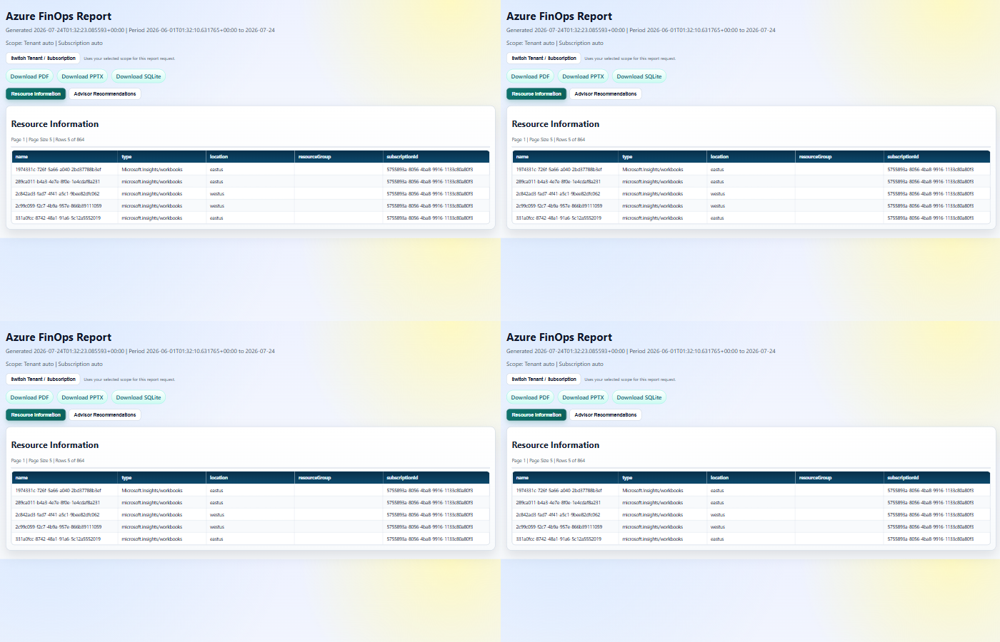
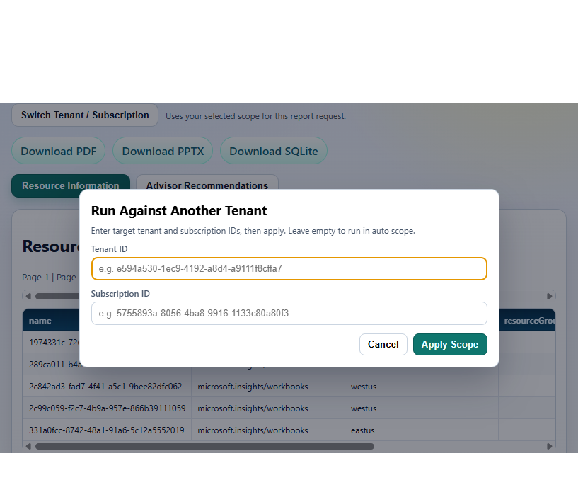

# Azure FinOps Agent

Azure Functions-based FinOps reporting service that inventories Azure resources, pulls cost and Advisor data, and generates downloadable artifacts.




## What This Project Does

- Collects Azure resource inventory across one or more subscriptions
- Pulls consumption usage data (when available)
- Pulls Azure Advisor recommendations
- Correlates recommendations to resources
- Generates artifacts:
  - SQLite database
  - PDF summary
  - PowerPoint summary
- Exposes report output in JSON and HTML

## Functions

- `run_finops_report` (HTTP): on-demand report generation
- `finops_artifact` (HTTP): artifact download endpoint
- `finops_health` (HTTP): runtime readiness endpoint
- `scheduled_finops_report` (Timer): runs daily at 06:00 UTC

## Quick Start

### Local deploy and run

Run the local bootstrap script:

```powershell
./deploy-local.ps1
```

What it does:

- creates `.venv` if needed
- installs dependencies from `requirements.txt`
- creates `local.settings.json` from `local.settings.sample.json` if missing
- compiles `function_app.py`
- starts Functions host (`func start`)

Then open:

- `http://localhost:7071/api/finops_health`
- `http://localhost:7071/api/run_finops_report?format=html&pageSize=25`

### Deploy to Azure (one click)

[](https://portal.azure.com/#create/Microsoft.Template/uri/https%3A%2F%2Fraw.githubusercontent.com%2Fjerrywolff_microsoft%2Ftokenpulse%2Fmain%2Ffinops-agent%2Finfra%2Fazuredeploy.json)

This button deploys `infra/azuredeploy.json`.

### Deploy to Azure (scripted)

Use the deployment script for end-to-end infra + code deploy:

```powershell
./deploy-azure.ps1 -SubscriptionId <subscription-guid> -ResourceGroup rg-finops-agent -Location eastus
```

What it does:

- verifies Azure login
- creates/updates resource group
- deploys infra from `infra/resources.bicep`
- zips function code and deploys with remote build
- restarts the function app
- prints health and report URLs

## Configuration

Environment settings used by the app:

- `FINOPS_ARTIFACT_DIR`: artifact output directory override
- `FINOPS_REPORT_DB_PATH`: SQLite path override
- `FINOPS_FX_SOURCE`: FX source (`env` or `url`)
- `FINOPS_FX_RATES_JSON`: FX rate payload (JSON)
- `FINOPS_MSAL_CLIENT_ID`: optional MSAL public client id for interactive UI login flow

## Scope Selection (Tenant / Subscription)

The HTML report includes a **Switch Tenant / Subscription** dialog.

- Set `tenantId` and `subscriptionId` to scope report execution.
- If omitted, scope is automatic.
- The app checks for subscriptions visible to the executing identity and returns a clear error if not accessible.

## Artifact Endpoints

After report generation:

- `/api/finops_artifact?name=database`
- `/api/finops_artifact?name=pdf`
- `/api/finops_artifact?name=powerpoint`

Default artifact names:

- `finops_reports.db`
- `finops_summary.pdf`
- `finops_summary.pptx`

## Troubleshooting

- `401` on HTTP routes is expected without function key in non-development environments.
- If Azure deploy fails at zip stage, verify:
  - subscription context (`az account show`)
  - RBAC on storage/function resources
  - storage network access and deployment permissions
- If report fails with subscription visibility errors, assign Reader RBAC to the app identity on target subscription(s).

## Full Regeneration Prompt (GitHub Copilot)

Use this prompt in GitHub Copilot Chat to recreate this project from scratch.

```text
Build a complete Azure Functions Python project named finops-agent from scratch. Recreate all source files, configuration, and docs so it runs locally and in Azure.

Goal:
Create an Azure FinOps reporting function app that:
- Connects to Azure subscriptions (CLI + managed identity fallback)
- Collects resource inventory
- Collects consumption usage for the reporting period
- Collects Azure Advisor recommendations
- Associates recommendations to resources
- Calculates commitment savings fields (Reservation and Savings Plan scenarios)
- Writes a SQLite report database
- Generates a PDF summary
- Generates a PowerPoint summary deck
- Exposes artifact download endpoints
- Returns tabular JSON and tabular HTML

Tech stack:
- Python 3.11+
- Azure Functions Python v2 programming model
- Dependencies: azure-functions, reportlab, python-pptx
- Keep implementation centered in function_app.py

Create files:
- function_app.py
- requirements.txt
- host.json
- local.settings.sample.json
- azure.yaml
- infra/resources.bicep
- infra/azuredeploy.json
- deploy-local.ps1
- deploy-azure.ps1
- README.md
- .gitignore

Functional requirements:
1) Function auth/runtime
- Function-level auth by default
- Anonymous routes only in Development environment
- Functions:
  - run_finops_report (GET/POST)
  - finops_artifact (GET)
  - finops_health (GET)
  - scheduled_finops_report (cron: 0 0 6 * * *)

2) Azure command execution
- Implement run_az helper
- If Azure CLI not found in host, use ARM REST + managed identity token
- Support fallback for:
  - account list
  - account set
  - resource list
  - advisor recommendation list
  - vm show
  - consumption usage handling

3) Data collection
- Compute reporting month boundaries
- Gather subscriptions/resources/costs/recommendations
- Correlate recommendation resourceId to resource name/type
- Handle missing fields safely

4) Savings calculation fields on each recommendation
- reservationSavings1Year, reservationSavings2Year, reservationSavings3Year
- savingsPlanSavings1Year, savingsPlanSavings2Year, savingsPlanSavings3Year
- savingsEstimateBasis, pricingCurrency, billingCurrency, currencyMatch
- savingsCurrency, fxApplied, fxRateApplied, fxSource
- estimatedAverageInstanceCount, observedUsageHoursInPeriod
- Use advisor annual savings as fallback when pricing math unavailable

5) Artifacts
- SQLite: finops_reports.db
- PDF: finops_summary.pdf
- PowerPoint: finops_summary.pptx
- Include metadata, costs, recommendation summaries

6) API output
- run_finops_report:
  - builds snapshot
  - generates artifacts
  - returns JSON by default
  - returns HTML when format=html or Accept prefers html
- Include pagination for tabular output

7) HTML report UX
- Tabs for Resource Information and Advisor Recommendations
- Artifact download links
- Horizontal scroll sync for wide tables
- Scope dialog for tenant/subscription selection
- Optional interactive Microsoft sign-in button and token-based request flow

8) Deploy functionality
- Local deploy script:
  - create venv, install deps, create local settings, compile, start host
- Azure deploy script:
  - login check
  - resource group create/update
  - Bicep deploy
  - zip deploy with remote build
  - restart app
  - print URLs
- Include Deploy to Azure button in README wired to infra/azuredeploy.json raw URL

9) Quality constraints
- No hardcoded secrets
- Type hints where practical
- Deterministic behavior and clear error messages
- Ensure python -m py_compile function_app.py passes

Acceptance checks:
- python -m py_compile function_app.py
- func start works locally
- run_finops_report returns data
- finops_artifact serves all artifacts
- finops_health returns readiness payload
```

## Repo Notes

- Build prompt archive remains in `docs/BUILD_PROMPTS.md`.
- If this repository path changes in GitHub, update the Deploy to Azure button URL to match the new raw file location.
