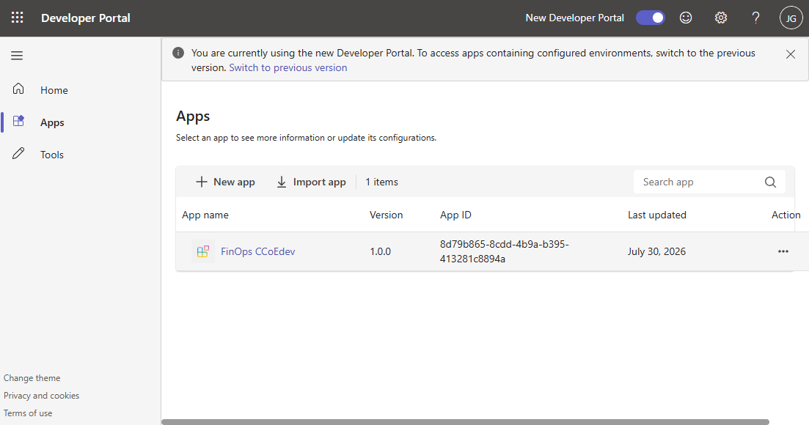
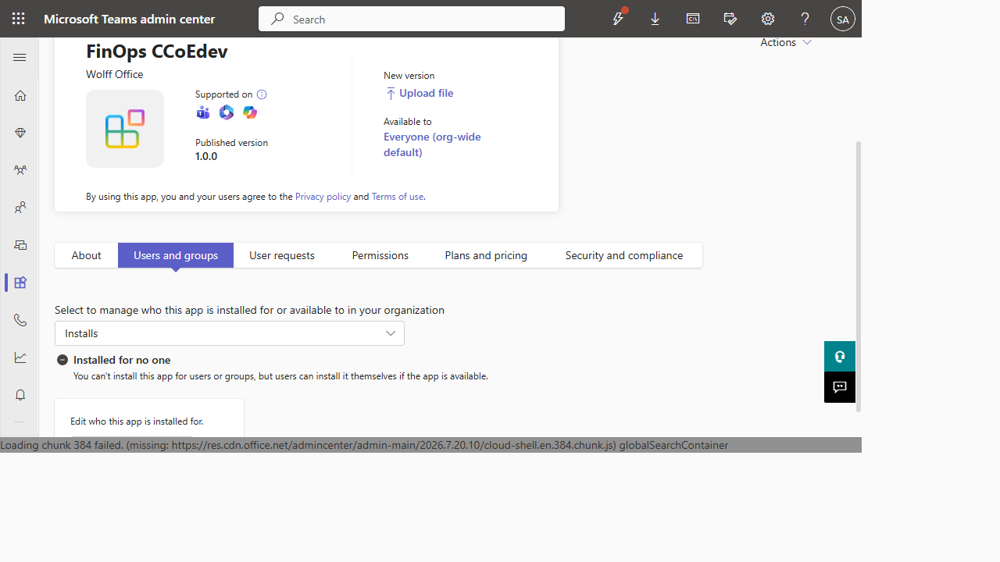
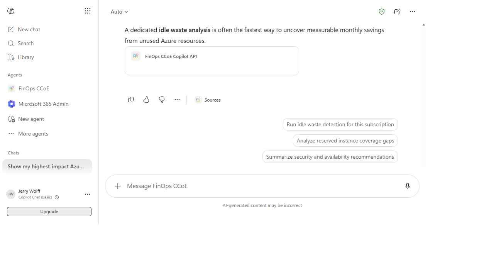

# Microsoft 365 Copilot Deployment Transcript

> Historical reference only. The IDs, URLs, accounts, and paths below belong to one deployment and must not be reused. Use `finops-copilot-agent/setup-tenant.ps1` to generate values for the authenticated target tenant.

Sanitized transcript of the successful FinOps CCoE deployment on July 30, 2026. Secrets, access tokens, passwords, and MFA details are intentionally omitted.

The terminal-format copy is available at [COPILOT_DEPLOYMENT_TRANSCRIPT.txt](COPILOT_DEPLOYMENT_TRANSCRIPT.txt).

## Outcome

- Package validation: passed
- Developer Portal import: succeeded
- Teams Admin Center upload: succeeded
- Tenant availability: everyone, organization-wide default
- Copilot self-install: succeeded
- Agent conversation: succeeded
- API action construction: succeeded
- OAuth sign-in prompt: reached as expected

## Terminal Transcript

```powershell
PS> Set-Location .\finops-copilot-agent

PS> ./build-package.ps1
Created ...\finops-copilot-agent\appPackage\build\appPackage.dev.zip

PS> $env:ATK_CLI_SKILL = 'true'
PS> atk validate --env dev --validate-method validation-rules

Microsoft 365 Agents Toolkit has checked manifest(s) with the corresponding schema:

Summary:
All passed.
Microsoft 365 Agents Toolkit has completed checking your app package against validation rules. All passed.

PS> # Package inspection
BUILD_EXIT_CODE=0
VALIDATION_EXIT_CODE=0
ZIP_SIZE_BYTES=10831
ZIP_ENTRIES:
adaptiveCards/runFinOpsReport1.json
apiSpecificationFile/openapi.yaml
ai-plugin.json
color.png
declarativeAgent.json
manifest.json
outline.png
OPENAPI_YAML_ORIGINAL_PRESENT=False
UNRESOLVED_TEMPLATE_TOKEN_PRESENT=False

PS> atk auth list --interactive false
Use `atk auth login azure` or `atk auth login m365` to log in to Azure or Microsoft 365 account.

PS> atk auth login m365 --tenant <tenant-id> --interactive false
# Browser authentication completed, but the local CLI callback did not return.
# Deployment continued through the supported Teams Admin Center upload path.
```

## Browser Deployment Transcript

1. Imported `appPackage.dev.zip` in Developer Portal.
2. Confirmed the app record and external app ID.
3. Developer Portal remote App Validation returned HTTP 500 even though local Toolkit validation passed.
4. Opened **Teams Admin Center > Teams apps > Manage apps**.
5. Selected **Actions > Upload new app** and uploaded the same ZIP.
6. Teams Admin Center reported **New app added**.
7. Confirmed version `1.0.0`, publisher, external app ID, and organization-wide availability.
8. Opened **Microsoft 365 Copilot > More agents**.
9. Found the app under **Built by your org** and selected **Add**.
10. Opened the installed **FinOps CCoE** agent and submitted a starter prompt.
11. Supplied the tenant and subscription scope.
12. Copilot generated the expected `optimization` API action with strict live mode.
13. Selected **Confirm** and reached the expected OAuth sign-in prompt.

## Screenshots

### Developer Portal Registration



### Teams Admin Center Publication



### Installed Copilot Agent Test



## Deployment Identifiers From This Run

The values are redacted because every tenant must create its own tenant ID, Entra app, OAuth registration, Teams app ID, and catalog app ID.

| Setting | Value |
| --- | --- |
| Teams external app ID | `<reference-teams-app-id>` |
| Tenant catalog app ID | `<reference-catalog-app-id>` |
| Installed declarative agent ID | `<reference-declarative-agent-id>` |
| Package version | `1.0.0` |

## Notable Findings

- Developer Portal registration does not install an agent for users.
- Developer Portal App Validation is not required when the package passes Toolkit validation and Teams Admin Center accepts it.
- Tenant publication and user installation are separate operations.
- Declarative agents may not support forced installation; users can add them from **Built by your org** when tenant availability permits.
- The agent can appear in Copilot Chat Basic, but tenant licensing and policy determine which capabilities are available.
- OAuth is verified only after confirming an API action and completing the agent-specific sign-in flow.