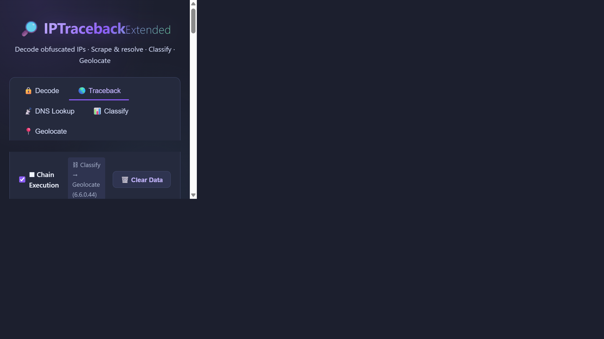
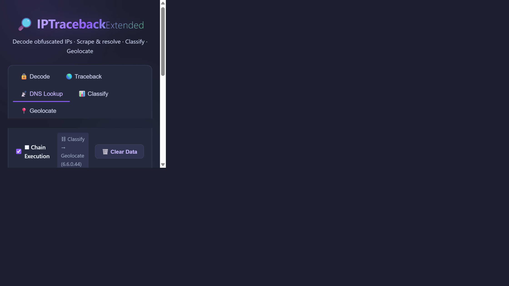
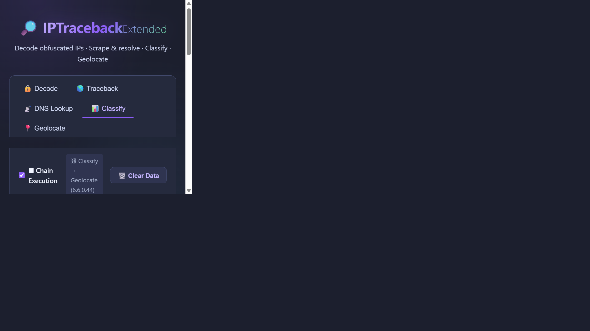
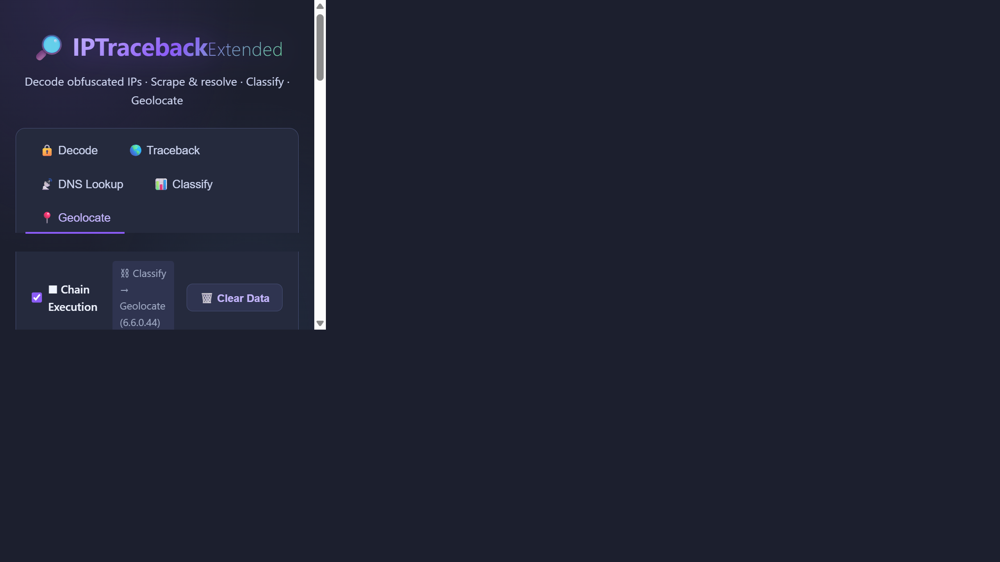

# IPTraceback Extended

> **Extended IP address decryption, extraction, classification, and geolocation tool** — discovers hidden IP addresses from encoded strings, URLs, hostnames, and DNS records, then traces every destination through a full intelligence pipeline.

[](https://nodejs.org) [](https://expressjs.com) [](#)

---

## What It Does

IPTraceback Extended takes obfuscated or encoded strings, URLs, and hostnames as input and automatically:

1. **Decodes** Base64, Hex, URL-encoded, Binary, Decimal (ASCII), ROT13, Caesar-shift, and Double-URL-encoded strings to extract hidden IP addresses
2. **Scrapes** URLs for IP addresses embedded in HTML, comments, and data attributes
3. **Resolves** hostnames via DNS (A, MX, TXT, NS records)
4. **Classifies** every discovered IP — version, class, public/private, numeric, hex, binary representations
5. **Geolocates** destination IPs with country, city, ISP, ASN, proxy detection, and map links
6. **Chains** all results automatically — output from one tab feeds directly into the next

---

## Architecture

```
User Input (encoded string / URL / hostname)
        │
        ▼
┌──────────────┐     ┌──────────────────┐     ┌─────────────────┐
│  Decode Tab  │────▶│  Traceback Tab   │────▶│  Classify Tab   │
│  (decoders)  │     │  (full pipeline) │     │  (IPv4/v6 info) │
└──────────────┘     └──────────────────┘     └────────┬────────┘
        │                     │                         │
        │                     ▼                         ▼
        │            ┌────────────────┐       ┌─────────────────┐
        └───────────▶│  DNS Lookup    │       │  Geolocate Tab  │
                     │  (A/MX/TXT/NS) │       │  (country/city/ │
                     └────────────────┘       │   ISP/proxy)    │
                                              └─────────────────┘

All tabs share a Reactive Chain Hub — results auto-populate downstream tabs.
```

### Reactive Chain Flow

| Trigger Tab | Auto-populates & executes |
|---|---|
| **Decode** | → Traceback (encoded input) + Classify (extracted IPs) + Geolocate (first public IP) |
| **Traceback** | → Classify (all source IPs) + Geolocate (first public IP) |
| **DNS Lookup** | → Classify (A-record IPs) + Geolocate (first IP) + Traceback (hostname) |
| **Classify** | → Geolocate (first public IP) |

---

## Installation

```bash
git clone https://github.com/jerrywolff_microsoft/tokenpulse.git
cd iptracebackextended
npm install
node server.js
```

Open **http://localhost:3001** in your browser.

---

## Usage

### 🔒 Decode Tab — Decode Obfuscated Strings

Paste any encoded string. The decoder tries all methods automatically (or select one manually).

**Supported encodings:**
- Base64: `OTMuMTg0LjIxNi4zNA==` → `93.184.216.34`
- Hex: `39322e3136382e312e31` → `92.168.1.1`
- URL Encoding: `38%2E38%2E38%2E38` → `8.8.8.8`
- Binary: `00110001.00101110.00110001...` → `1.1.1.1`
- Decimal (ASCII): `56 50 46 51 ...` → IP address
- ROT13 / Caesar-shift / Brute-force rotation


---

### 🌎 Traceback Tab — Full Pipeline

Run the complete decode → scrape → resolve → classify → geolocate pipeline in a single operation.

**Inputs:**
- Encoded strings (one per line)
- Hostnames to resolve via DNS
- URLs to scrape for embedded IPs

**Example:** Testing with `forms.office.com` and a Microsoft Forms URL:



Results include:
- **Destination IPs Found** — all IPs extracted from your inputs
- **Decoded Inputs** — each encoded string decoded with method label
- **DNS Results** — resolved A records for each hostname
- **Destination IP Classifications** — IPv4/v6, public/private, hex, binary
- **Destination Geolocation** — country, city, ISP, proxy status

---

### 📡 DNS Lookup Tab — Resolve Hostnames

Look up A, MX, TXT, and NS records for any hostname. Results automatically chain to Classify and Geolocate.

**Example hostnames:** `example.com`, `google.com`, `cloudflare.com`, `github.com`



---

### 📊 Classify Tab — IP Classification

Classify one or many IPs (IPv4 and IPv6) to see detailed technical breakdown.

**Per-IP output:**
- IP version (IPv4 / IPv6)
- Public / Private status
- Class (A / B / C / D / E)
- Numeric representation
- Hexadecimal (`5d:b8:d8:22`)
- Binary (`01011101.10111000.11011000.00100010`)



---

### 📍 Geolocate Tab — IP Geolocation

Geolocate any public IPv4 address to get detailed location and identity information.

**Output includes:**
- Country, Region, City, Postal code
- Latitude / Longitude with OpenStreetMap link
- ISP, Organization, ASN
- Reverse DNS
- Proxy/VPN detection
- Hosting provider flag
- Timezone



---

## API Reference

The Express server exposes 7 REST endpoints:

| Method | Endpoint | Description |
|--------|----------|-------------|
| `POST` | `/api/decode` | Decode an encoded string, extract IPs |
| `POST` | `/api/traceback` | Full pipeline: decode + scrape + DNS + classify + geolocate |
| `GET` | `/api/dns/:hostname` | A/MX/TXT/NS record lookup (cached 1hr) |
| `GET` | `/api/classify/:ip` | Classify a single IP address |
| `GET` | `/api/geolocate/:ip` | Geolocate a single public IP (cached 1hr) |
| `POST` | `/api/trace` | Batch classify + geolocate up to 20 IPs |
| `GET` | `/api/public-ip` | Discover the caller's own public IP |
| `GET` | `/api/cache-clear` | Flush server-side result cache |

### POST /api/decode

```json
{ "input": "OTMuMTg0LjIxNi4zNA==", "method": "auto" }
```

### POST /api/traceback

```json
{
  "encodedInputs": ["OTMuMTg0LjIxNi4zNA=="],
  "hostnames": ["forms.office.com"],
  "scrapeURLs": ["https://forms.office.com/Pages/ResponsePage.aspx?id=..."],
  "geolocate": true,
  "discoverPublic": false
}
```

---

## Module API

```js
const IPTracebackExtended = require('./index.js');
const ipt = new IPTracebackExtended();

// Decode an encoded string
const decoded = await ipt.decode('OTMuMTg0LjIxNi4zNA==', 'base64');

// Full traceback pipeline
const result = await ipt.traceback({
  encodedInputs: ['OTMuMTg0LjIxNi4zNA=='],
  hostnames: ['example.com'],
  scrapeURLs: ['https://forms.office.com/Pages/ResponsePage.aspx?id=...'],
  geolocate: true,
  discoverPublic: false
});

// DNS lookup
const dns = await ipt.dnsLookupAll('example.com');

// Classify an IP
const classification = ipt.classify('93.184.216.34');

// Geolocate a destination IP
const geo = await ipt.geolocate('93.184.216.34');
```

---

## UI Features

| Feature | Description |
|---|---|
| **Chain Execution** | Toggle automatic cross-tab data flow on/off |
| **🗑️ Clear Data** | Flush all forms, results, and server cache in one click |
| **Example chips** | One-click test inputs that auto-submit each tab |
| **Copy to clipboard** | Click any IP or value to copy |
| **Export JSON** | Download full results as a `.json` file |
| **OpenStreetMap link** | Direct map link for any geolocated IP |
| **Cache badge** | `⚡ Cached` indicator shows when results came from server cache |

---

## Technical Notes

- **Server cache:** 1-hour TTL, max 500 entries. DNS and geolocation results are cached to reduce external API calls.
- **Input limits:** 20 encoded inputs, 10 hostnames, 5 URLs, 3 geolocate IPs per request.
- **URL scraping:** Fetches HTML content and extracts valid IPv4/IPv6 patterns using `net.isIPv4()` / `net.isIPv6()` validation.
- **Geolocation provider:** [ip-api.com](https://ip-api.com) — results are approximate and do not represent exact physical addresses.
- **Chain deduplication:** The reactive hub uses per-run normalization (no cross-run IP dedup), so every new submission triggers a fresh downstream chain.

---

## Project Structure

```
iptracebackextended/
├── index.js              # IPTracebackExtended class (main module)
├── server.js             # Express REST API server
├── decoders/             # Encoding/decoding implementations
├── sourceExtractors/     # URL scraping, DNS, public IP discovery
├── utils/                # IP validation, classification, geolocation
├── public/
│   ├── index.html        # 5-tab UI
│   ├── style.css         # Dark theme styles
│   └── app.js            # Frontend logic + reactive chain hub
├── docs/
│   └── screenshots/      # UI screenshots
└── package.json
```

---

## License

MIT — for informational and security research purposes only. Geolocation data from [ip-api.com](https://ip-api.com).
