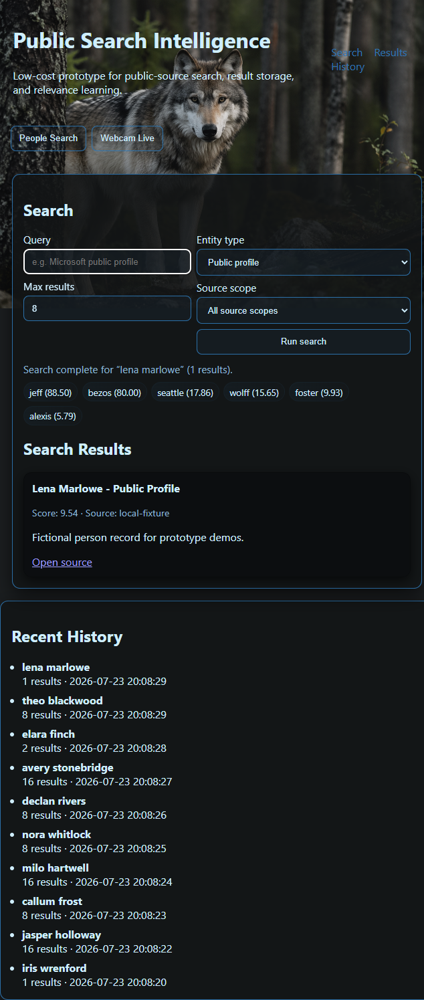
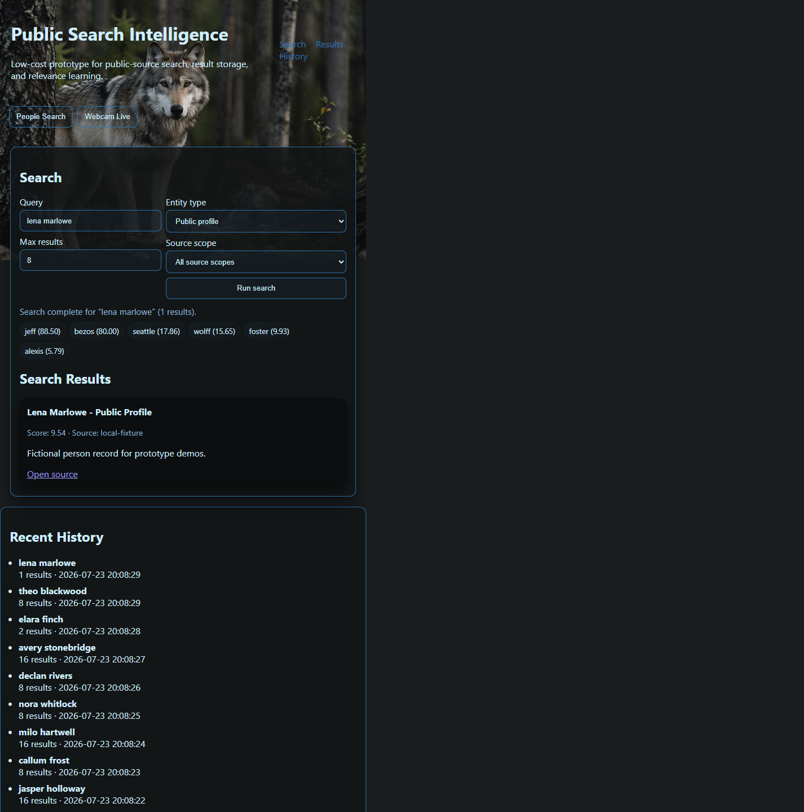
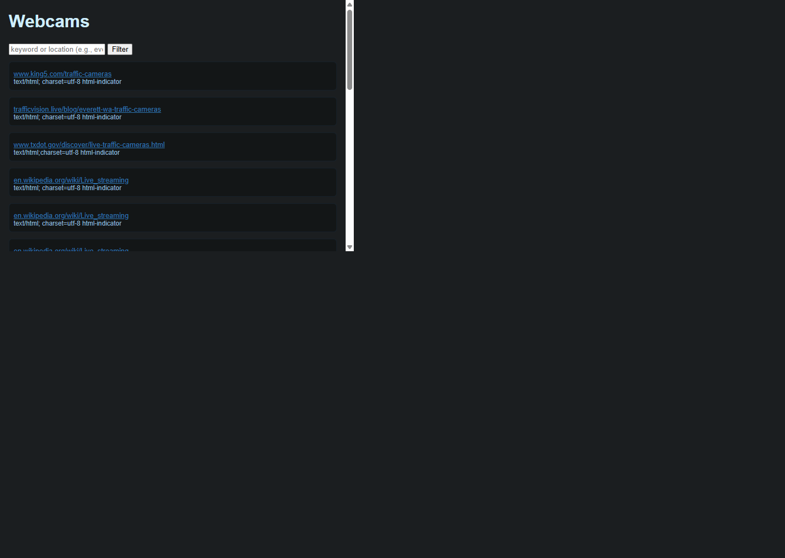

# People Search MVP

People Search MVP is a Python Flask web application that discovers and ranks public search results, scans potential webcam and livestream URLs, stores scan intelligence in SQLite, and provides export/import plus history endpoints.

## Features

- Multi-source public web search aggregation (DuckDuckGo Lite, Brave, and Wikipedia)
- Result scoring with simple adaptive term weighting
- Webcam and stream scanner with URL pattern expansion
- Background scan jobs (threaded fallback, optional Redis + RQ queue)
- CSV export/import of scan results
- Search history and saved webcam browsing endpoints
- Source scope selector with an all-source-scopes default route
- Search refinements for official county records, social media sites, country, state, county, and city
- Result ordering by relevance, first name, or last name
- Configurable searches returning up to 100 results
- Record-centric results that extract page summaries and structured fields instead of presenting site links
- Clickable record cards with persisted in-app detail pages and guarded original-record access
- Explicit public employment, income-source, work-status, and third-party net-worth highlights in result cards when sources state them
- Exact-name public-person queries that preserve location refinements without requiring brittle profile phrases
- First-click reliable search submit handling in the web UI
- Deterministic fallback records for no-provider-result scenarios
- Local deployment script for your computer
- Azure deployment script and Azure ARM template for one-click infrastructure

## Recent Changes (2026-07-23)

- Improved first-click search reliability by handling both form submit and explicit run-button click with in-flight request guarding.
- Added Wikipedia provider support and source-scope routing for all/all_source_scopes/web/news input values.
- Added fallback result behavior when live providers return no items (fictional fixtures and generic fallback links).
- Added `/health` endpoint and strengthened local run behavior with auto-port failover to avoid port conflicts.
- Updated local startup scripts so `APP_AUTO_PORT=1` is enabled by default for smoother multi-project local development.
- Refreshed screenshots in `docs/screenshots/` to match current UI and flows.

## Deploy To Azure Button

[](https://portal.azure.com/#create/Microsoft.Template/uri/https%3A%2F%2Fraw.githubusercontent.com%2Fjerrywolff_microsoft%2Fpeople_search_mvp%2Fmain%2Finfra%2Fazuredeploy.json)

Direct URL:

`https://portal.azure.com/#create/Microsoft.Template/uri/https%3A%2F%2Fraw.githubusercontent.com%2Fjerrywolff_microsoft%2Fpeople_search_mvp%2Fmain%2Finfra%2Fazuredeploy.json`

## Local Deployment Functionality

Use the local deployment script:

```powershell
Set-Location <path-to-repo>
.\deploy-local.ps1 -Port 5000
```

What it does:

1. Creates `.venv` if it does not exist
2. Installs dependencies from `requirements.txt`
3. Starts Flask app on the provided port (or the next free port if that port is already in use)

Port conflict behavior:

- Local launchers enable `APP_AUTO_PORT=1` by default.
- If port `5000` is busy, the app automatically moves to `5001`, `5002`, and so on.
- This prevents clashes when running multiple local projects at the same time.

App URLs:

- Home: `http://localhost:5000/`
- Health: `http://localhost:5000/health`

## Azure Deployment Functionality

### Prerequisites

- Azure CLI installed (`az`)
- Logged in (`az login`)
- Permission to create Resource Group + App Service resources

### Deploy with script

```powershell
Set-Location <path-to-repo>
.\deploy-azure.ps1 -ResourceGroup rg-people-search-mvp -Location eastus -AppName people-search-mvp-unique
```

What it does:

1. Creates/updates resource group
2. Deploys `infra/azuredeploy.json` (Linux App Service Plan + Python Web App)
3. Packages app code and static assets into zip
4. Zip deploys code to Azure Web App
5. Prints live URL

## Project Structure

```text
.
|- app.py
|- deploy-local.ps1
|- deploy-azure.ps1
|- infra/
|  |- azuredeploy.json
|- templates/
|  |- index.html
|  |- webcams_page.html
|- static/
|  |- app.js
|  |- index.html
|  |- style.css
|- requirements.txt
|- README.md
```

## API Overview

- `GET /` main UI
- `GET /health` health check
- `POST /search` aggregated web search + ranking
- `POST /scan_webcams` webcam/stream scan (sync or background)
- `POST /enqueue_scan` enqueue background scan
- `GET /scan_status?task_id=...` scan task progress
- `GET /saved_webcams` paginated webcam records
- `GET /export_webcams?which=success|failure` CSV export
- `POST /import_webcams?which=success|failure` CSV import
- `GET /history` recent search history

## People Search Screenshots

### 1. Home and Search Interface

Shows the current People Search landing state with search controls and recent history.



---

### 2. Search Execution and Results State

Shows the UI after running a search using fictional sample names, including status and results area behavior.



---

### 3. Webcam Live Page

Shows the live webcam listing page with filter controls and detected sources.

Screenshot refresh date: 2026-07-23



## Full Regenerate Prompt For GitHub Copilot

Use this prompt in GitHub Copilot Chat to recreate this entire project from scratch:

```text
Create a complete production-ready Python Flask project named "People Search MVP" in the current workspace.

Core objective:
Build a web intelligence app that can search public web sources, score results, discover webcam/stream URLs, scan and store results, and deploy locally or to Azure App Service.

Technical requirements:
1) Runtime and stack
- Python 3.11+
- Flask app entrypoint in app.py
- requests and beautifulsoup4 for data extraction
- sqlite3 for persistence
- optional background jobs with redis + rq (graceful fallback if unavailable)

2) File and folder structure
- app.py
- templates/index.html
- templates/webcams_page.html
- static/app.js
- static/style.css
- requirements.txt
- deploy-local.ps1
- deploy-azure.ps1
- infra/azuredeploy.json
- README.md
- .gitignore

3) Flask endpoints
- GET / : render UI template
- GET /health : return JSON {"status":"ok"}
- POST /search : accept query, source filter, max_results; aggregate from DuckDuckGo and Brave; deduplicate URLs; score/rank; persist to SQLite
- POST /scan_webcams : accept URL/pattern/keyword input; expand patterns; scan links for stream heuristics; persist success/failure
- POST /enqueue_scan : enqueue background scan task
- GET /scan_status : task progress by task_id or job_id
- GET /saved_webcams : paginated filtered records
- GET /export_webcams : CSV export for success/failure tables
- POST /import_webcams : CSV import for success/failure tables
- GET /history : latest searches
- GET /webcams_page : render public-facing saved webcam page

4) Database schema (SQLite)
Create tables if not present:
- searches(id, query, filters, result_count, created_at)
- search_results(id, search_id, title, url, snippet, source, score)
- learning_terms(term, weight)
- webcam_scans(id, created_at)
- webcam_success(id, scan_id, url, status_code, content_type, note, created_at)
- webcam_failure(id, scan_id, url, error, created_at)
- webcam_tasks(id, scan_id, job_id, status, progress, total, created_at, updated_at)

5) Scanning logic
- Support direct URLs, bare domains, keyword-based expansion via web search
- Pattern expansion support:
	- numeric range: https://example.com/cam{1-10}
	- wildcard replacement using * and replacement values
- Heuristics for stream detection:
	- URL extensions (.m3u8, .mjpeg, .mp4, .mjpg)
	- Content-Type checks for video/mpegurl
	- HTML indicators (camera/webcam/stream/live)

6) Search and ranking
- Providers: DuckDuckGo and Brave
- Merge and deduplicate by URL
- Compute score from query term matches + adaptive learning term weights
- Store searches and result items in DB
- Return diagnostics and fetch errors in response

7) Local deployment functionality
Create deploy-local.ps1 that:
- creates .venv if missing
- installs requirements
- sets PORT variable
- runs python app.py

8) Azure deployment functionality
Create infra/azuredeploy.json ARM template that provisions:
- Linux App Service Plan
- Linux Python 3.11 Web App
- app settings: SCM_DO_BUILD_DURING_DEPLOYMENT=true, WEBSITE_RUN_FROM_PACKAGE=1
- startup command: gunicorn --bind=0.0.0.0 --timeout 600 app:app

Create deploy-azure.ps1 that:
- accepts ResourceGroup, Location, AppName, optional PlanName and Sku
- verifies az cli and login
- creates resource group
- deploys ARM template
- packages app.py, templates, static, requirements.txt into zip
- runs az webapp deployment source config-zip
- prints resulting app URL

9) README requirements
- Explain project purpose and architecture
- Include local deployment instructions
- Include Azure deployment instructions
- Include Deploy to Azure button URL format referencing infra/azuredeploy.json in raw GitHub path
- Include API summary and project tree
- Include this full regenerate prompt block verbatim

10) Quality constraints
- Keep code ASCII-only
- Validate inputs and return clear errors
- Add concise comments only for non-obvious logic
- Ensure app can run with `python app.py` locally
```

## Quick Commands

```powershell
# local
.\deploy-local.ps1 -Port 5000

# azure
.\deploy-azure.ps1 -ResourceGroup rg-people-search-mvp -Location eastus -AppName people-search-mvp-unique
```
