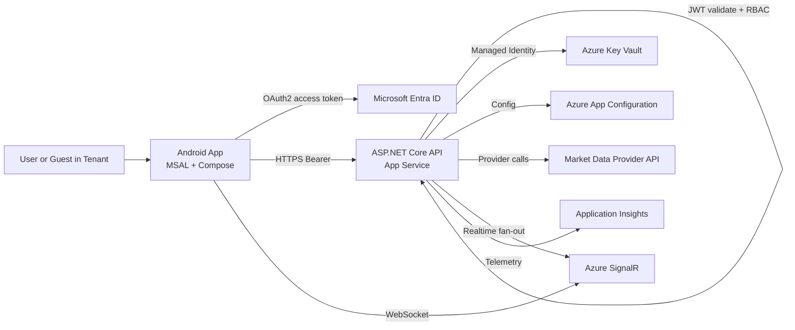

# StockStreamPortfolio Architecture

## System Overview

- Android app (Kotlin + Jetpack Compose + MSAL) authenticates with Microsoft Entra ID.
- Backend API (ASP.NET Core on Azure App Service) enforces JWT bearer auth and role-based policies.
- Azure SignalR Service supports real-time quote push from backend to mobile clients.
- Backend retrieves provider API key from Azure Key Vault using managed identity.
- Application Insights collects telemetry with PII-safe logging.

## Architecture Diagram

## Key Security Rules

- No market provider secrets in Android app.
- Backend only uses Key Vault or secure app settings for provider credentials.
- HTTPS-only endpoints.
- Role gates: `Admin`, `User`.
- Production startup fails if provider config is missing.

## Data Integrity Rules

- Quote row includes `dataSource`, `retrievedAtUtc`, `marketStatus`, `freshnessStatus`, and `isLive`.
- No synthetic financial values are generated in runtime code.
- Missing provider fields remain unavailable.
- Closed/unknown markets return explicit unavailable status.
