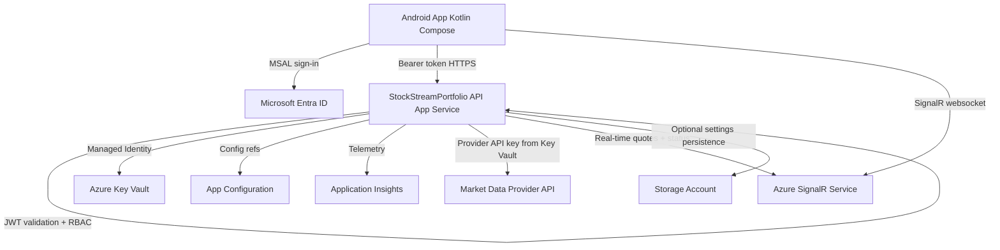

# StockStreamPortfolio Implementation Plan

## Chosen Backend Approach

**Choice: Azure App Service hosted ASP.NET Core REST API + Azure SignalR Service**

Reasoning:
- Mobile backends benefit from long-running API process behavior (auth middleware, SignalR hubs, OpenAPI, role policies) without Function trigger constraints.
- App Service with SignalR gives straightforward real-time fan-out and stable websocket support.
- Controlled REST polling fallback can run in the Android client if websocket connectivity drops.

## Architecture Diagram

## Azure Resources List

- Resource Group
- App Service Plan (Linux)
- App Service Web App (ASP.NET Core backend)
- Azure SignalR Service (serverless mode acceptable, default mode for negotiated clients)
- Azure Key Vault
- Azure Application Insights + Log Analytics workspace
- Azure App Configuration
- Storage Account (optional metadata persistence and deployment artifacts)
- Microsoft Entra App Registration: Android native client
- Microsoft Entra App Registration: Backend API app

## Authentication Flow

1. User launches Android app.
2. App forces MSAL sign-in before any portfolio/watchlist/quotes UI loads.
3. MSAL acquires access token for backend API scope.
4. App sends bearer token to backend over HTTPS.
5. Backend validates JWT issuer, audience, signature, expiry, tenant constraints.
6. Backend enforces role policies:
   - `Admin` policy for global settings/provider/user authorization endpoints.
   - `User` policy for self watchlist/layout/views endpoints.
7. Guest users are supported if invited to tenant and assigned role/group claims.

## Data Flow

1. User edits watchlist/views/columns in Android app.
2. App sends authenticated API requests.
3. Backend validates symbols (format + provider existence check) before activation.
4. Backend pulls quote/market status from provider abstraction `MarketDataProvider`.
5. Backend annotates every quote payload with:
   - `dataSource`
   - `retrievedAtUtc`
   - `marketStatus`
   - `freshnessStatus`
   - `isLive`
6. Backend broadcasts updates to subscribed users via SignalR.
7. Client fallback polling is used only if streaming is unavailable and within admin/user/provider interval limits.

## No-Hallucinated-Data Enforcement Points

- Runtime provider guard: production quote service refuses to return synthetic/generated market values.
- Provider config guard: startup health check reports misconfiguration if provider credentials missing.
- Field integrity: missing provider fields remain null/unavailable; no extrapolation.
- Stale/delayed handling: freshness and delayed flags are explicit; `isLive=true` only when provider confirms live/current in active market.
- Market closed handling: response includes "Market closed or live data unavailable." and no fake updates.
- CSV baseline isolation: imported CSV values are stored and labeled as baseline/imported, never as live.
- Test coverage includes explicit no-fake-data tests and provider failure behavior tests.

## Project Structure

- `android-app/` Kotlin + Jetpack Compose + MSAL + MVVM app
- `backend/` ASP.NET Core API + SignalR + Entra auth + provider abstraction + OpenAPI
- `infra/` Bicep + Azure CLI deploy scripts + environment templates
- `.github/workflows/` CI/CD workflow for backend + Android build/test + infra validation
- `docs/` architecture, setup, auth, provider, policy, runbook
