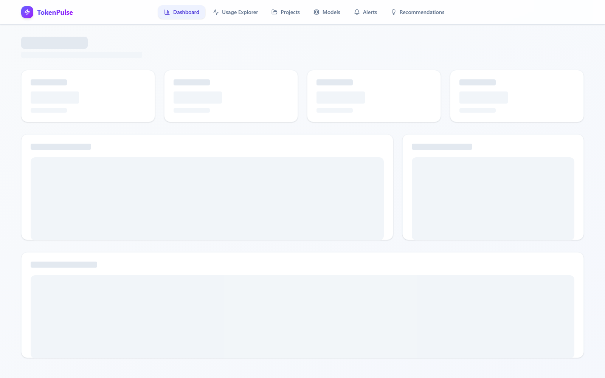
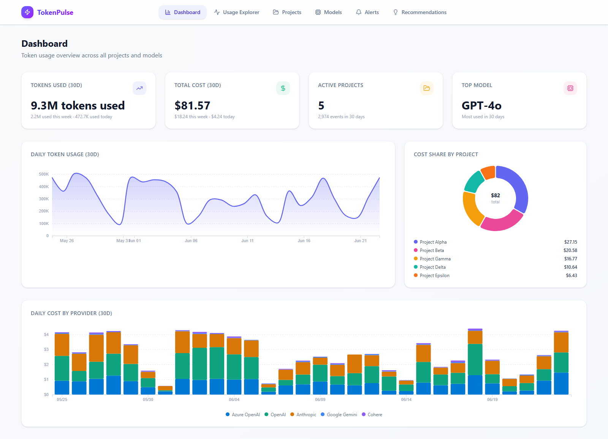

# TokenPulse

[](https://github.com/Jerrywolffms/jerrywolffms/actions/workflows/ci.yml)
[](https://github.com/Jerrywolffms/jerrywolffms/actions/workflows/deploy-pages.yml)


TokenPulse is a React + TypeScript dashboard for analyzing token usage, spend, and optimization opportunities across projects and models.

It includes:

- A multi-page analytics UI (Dashboard, Usage Explorer, Projects, Models, Alerts, Recommendations)
- Simulated policy application for cost recommendations (per policy and apply-all)
- CI checks on pull requests and pushes
- Automated GitHub Pages deployment on push to `main`

## Table of Contents

- Overview
- Tech Stack
- Features
- Screenshots
- Quick Start
- Available Scripts
- App Routes
- Project Structure
- Data Model
- Deployment and Redeploy from GitHub
- Troubleshooting
- Development Notes
- Future Improvements

## Overview

TokenPulse is currently a frontend analytics app backed by deterministic sample data in `src/data/sampleData.ts`.

The app is designed so that data access and query logic are centralized in `src/data/queries.ts`, making it straightforward to replace sample data with an API later.

## Tech Stack

- React 19
- TypeScript 6
- Vite 8
- Tailwind CSS 4
- React Router 7
- D3 for charts
- Lucide icons
- Oxlint

## Features

- Dashboard
  - 30-day token and cost KPIs
  - Daily token trend
  - Cost share by project
  - Daily provider cost distribution
- Usage Explorer
  - Filter by provider, project, date range
  - Sort by timestamp/tokens/cost
  - Paginated event-level table with totals
- Projects
  - Cost and token breakdown by project
  - Project detail drill-down with model-level table
- Models
  - Model usage and pricing comparisons
  - Input/output price charts
- Alerts
  - Create, edit, enable/disable, and delete budget alerts
  - Global or project-scoped thresholds
- Recommendations
  - Cost-reduction suggestions generated from usage profile
  - Policy simulation controls per recommendation
  - Apply all / Reset simulation
  - Live projected before/after cost summary

## Screenshots

Add screenshots to the `docs/screenshots/` folder using the filenames below.

Auto-capture from local routes:

```bash
npm run screenshots:install
npm run dev
npm run screenshots:capture
```

Optional custom URL:

```bash
BASE_URL=http://localhost:5174 npm run screenshots:capture
```

### Dashboard

Main KPI and trend overview.



### Usage Explorer

Event-level filtering and sorting table.


### Projects

Project spend cards and drill-down detail view.


### Models

Model pricing and usage comparison.


### Alerts

Budget alert configuration and status cards.



### Recommendations

Cost optimization recommendations with policy simulation.


## Quick Start

### Prerequisites

- Node.js 20+ (Node.js 22 recommended)
- npm 10+

### Install

```bash
npm ci
```

### Run locally

```bash
npm run dev
```

Vite will print the local URL, typically:

- `http://localhost:5173`
- Or next available port (for example `http://localhost:5174`) if 5173 is occupied

### Build

```bash
npm run build
```

### Preview production build

```bash
npm run preview
```

## Available Scripts

- `npm run dev`
  - Start Vite development server
- `npm run build`
  - Type-check (`tsc -b`) and create production bundle in `dist/`
- `npm run preview`
  - Serve production build locally
- `npm run lint`
  - Run Oxlint checks
- `npm run screenshots:install`
  - Install Playwright Chromium browser
- `npm run screenshots:capture`
  - Capture page screenshots into `docs/screenshots/`

## App Routes

The app uses `HashRouter` for static-host compatibility.

Routes:

- `/#/` Dashboard
- `/#/usage` Usage Explorer
- `/#/projects` Projects
- `/#/models` Models
- `/#/alerts` Alerts
- `/#/recommendations` Recommendations

Why hash routing is used:

- GitHub Pages does not provide SPA rewrite rules by default
- Hash routes prevent 404/route refresh issues on static hosting

## Project Structure

```text
tokenpulse/
  .github/
    workflows/
      ci.yml
      deploy-pages.yml
  public/
  src/
    components/
      charts/
      ui/
      Layout.tsx
    data/
      sampleData.ts
      queries.ts
      types.ts
    pages/
      AlertsPage.tsx
      DashboardPage.tsx
      ModelsPage.tsx
      ProjectsPage.tsx
      RecommendationsPage.tsx
      UsageExplorerPage.tsx
    App.tsx
    main.tsx
  vite.config.ts
  package.json
```

## Data Model

Core types are defined in `src/data/types.ts`:

- `Provider`
- `Model`
- `Project`
- `UsageEvent`
- `Alert`

Current data source:

- `src/data/sampleData.ts` generates deterministic 30-day usage events

Query and formatting helpers:

- `src/data/queries.ts`

## Deployment and Redeploy from GitHub

### Included workflows

- `.github/workflows/ci.yml`
  - Trigger: pull requests and pushes to `main`
  - Steps: install, lint, build

- `.github/workflows/deploy-pages.yml`
  - Trigger: pushes to `main` and manual dispatch
  - Steps: install, build, upload Pages artifact, deploy

### One-time GitHub setup

1. Push this repository to GitHub.
2. Open repository Settings > Pages.
3. Set Source to GitHub Actions.
4. Ensure default branch is `main`.
5. Push a commit to `main` (or run deploy workflow manually).

### Redeploy flow

- Automatic: every push to `main`
- Manual: Actions > Deploy to GitHub Pages > Run workflow

### Build base path

Deployment workflow builds with:

```bash
npm run build -- --base=./
```

This ensures static assets resolve correctly when published by GitHub Pages.

## Troubleshooting

### Vite 403: outside of serving allow list (Windows)

Symptom:

- `403 Restricted` with `outside of Vite serving allow list`

Fix in this project:

- `vite.config.ts` has `server.fs.strict = false`
- Path allow list includes normalized variants

If it still appears:

1. Stop all running dev servers
2. Start again from project root: `npm run dev`
3. Open localhost URL printed by Vite (not a direct file path)

### Wrong app starts in terminal

If another project starts instead, run:

```powershell
cmd /c "cd /d c:\.git\tokenpulse && npm run dev"
```

### Port already in use

Vite will auto-select the next free port. Open the exact URL shown in terminal.

### GitHub Pages deploy does not run

Check:

1. Repo has Actions enabled
2. Pages Source is GitHub Actions
3. Push target is `main`
4. Workflow permissions include `pages: write` and `id-token: write`

## Development Notes

- Keep UI logic in page components under `src/pages/`
- Keep shared components in `src/components/ui/` and `src/components/charts/`
- Keep data querying/aggregation in `src/data/queries.ts`
- Prefer adding types in `src/data/types.ts` before implementing features

## Future Improvements

- Replace sample data with a backend API
- Add authentication and per-team scopes
- Add persisted alert policies and recommendation state
- Add CSV export for usage and recommendation reports
- Add end-to-end tests for route flows and key dashboards
